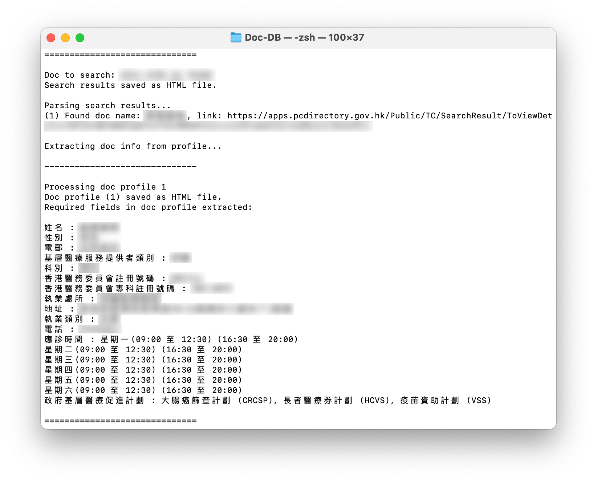
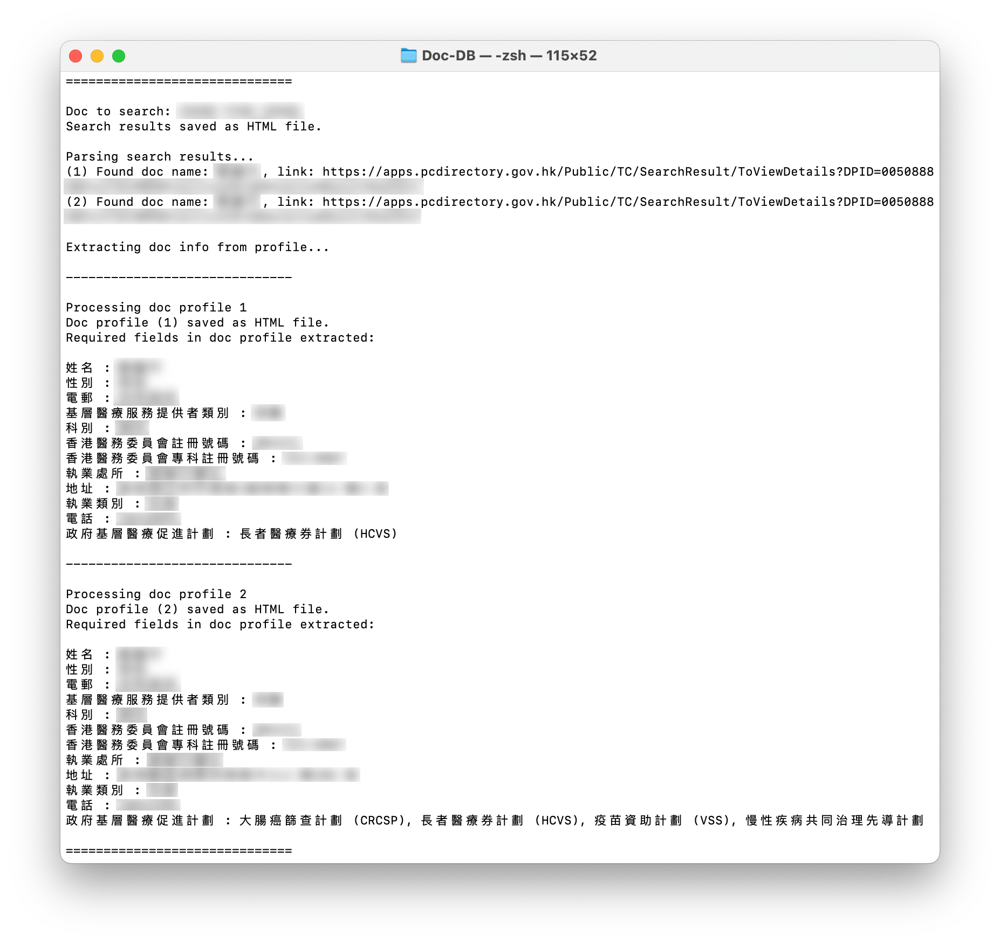
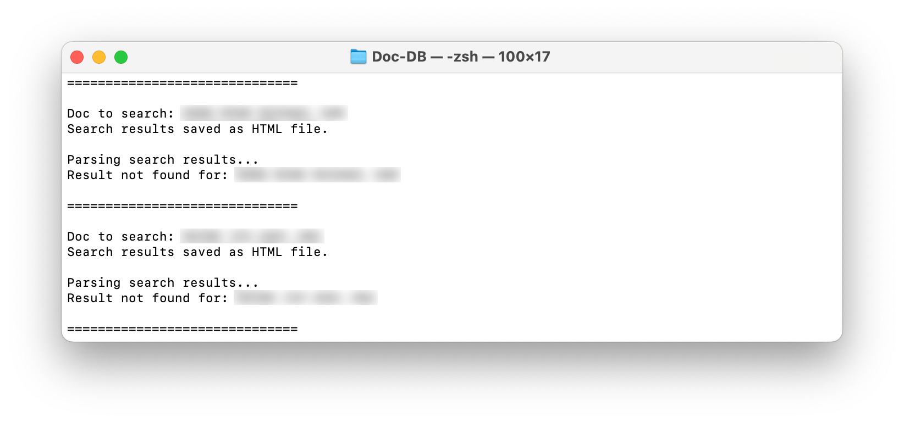

# Doc DB

A Python script designed to automate the collection of specified doctor profile and clinic information from the Hong Kong government's [Primary Care Directory](https://apps.pcdirectory.gov.hk/Public/TC) website. This tool aims to streamline the data collection process by automatically retrieving and organising the essential healthcare provider details into a structured format.

## Table of Contents

- [Preparation](#preparation)
- [Usage](#usage)
- [Screenshots](#screenshots)
- [Output](#output)
- [Note](#note)
- [Disclaimer](#disclaimer)

## Preparation

1. Have a working Python environment
2. Install required packages specified in `requirements.txt`
3. Follow the `.env.example` template to create a `.env` with cookie values
4. Create a `doc_names.xlsx` Excel file under the `input_output` directory following the `doc_names_sample.xlsx` template
5. Add a list of doctor names you intend to search under the `name` column in `doc_names.xlsx`

## Usage

Once complete all steps for preparation and specify a list of doctor names in the input Excel file, you can either execute the Python script or run blocks of code step by step in the given Jupyter Notebook.

### 1. Python Script

```python
python doc_collector.py
```

### 2. Jupyter Notebook

Open the `doc_collector_notebook.ipynb` and execute blocks of code.

## Screenshots

### Sample Result

<p align="center">
    
    <br>Sample Result</br>
</p>

### Multiple Results

<p align="center">
    
    <br>Multiple Results</br>
</p>

### No Result Found

<p align="center">
    
    <br>No Result Found</br>
</p>

## Output

The extracted doctor profile and clinic information will be organised and saved as the output Excel file named `doc_profile_result.xlsx`. The output file will contain following fields as columns:

| Search Name | 姓名 | 性別 | 電郵 | 基層醫療服務提供者類別 | 科別 | 香港醫務委員會註冊號碼 | 執業處所 | 地址 | 執業類別 | 電話 | 應診時間 | 政府基層醫療促進計劃 |
| ----------- | ---- | ---- | ---- | ---------------------- | ---- | ---------------------- | -------- | ---- | -------- | ---- | -------- | -------------------- |

## Note

1. During the execution of the script, there will be a few HTML files downloaded as cache under the temporary `temp` directory.
2. Cache files along with the `temp` directory will be removed upon the completion of the execution.

## Disclaimer

The tool is designed for experimental purposes only. The use of this tool is subject to adherence to ethical and legal standards. This tool is not intended for the purpose of damaging or intruding upon relevant websites or servers or its appointment system.
